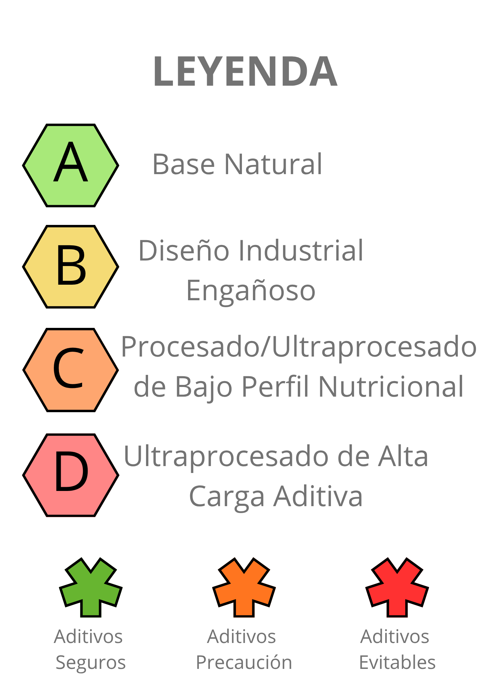

# Nutriscore 2.0: Hacia un etiquetado alimentario más transparente

> **Continuación de:** [Análisis Exploratorio de Datos - Nutriscore es Incompleto y Manipulable](https://github.com/mikel-ao/food-labelling-audit.git)
> 
> **Presentación:** [Canva](https://canva.link/m8gp6zmxdfyloks)
>
> **Prototipo de** [Nutriscore 2.0](https://nutriscore2-0.streamlit.app/)

## 📋 Resumen Ejecutivo

Este proyecto de ML no supervisado es la **evolución del análisis exploratorio previo** que concluyó que el **Nutriscore clásico** (basado únicamente en nutrientes) es incompleto y puede ser manipulable. Un producto puede tener Nutriscore A pero ser ultraprocesado y lleno de aditivos químicos. Nutriscore 2.0 soluciona esto combinando 3 dimensiones:
 
- **Nutrientes** (Nutriscore 1-5)
- **Procesamiento** (NOVA 1-4)
- **Aditivos** (Safety Index basado en PubMed)

**Resultado:** 4 categorías claras + información sobre riesgo de aditivos

---

## 🎯 Contexto del Problema

### ¿Por qué Nutriscore 2.0?

En 2026, **millones de alimentos** circulan en mercados europeos, pero los consumidores solo tienen **UN etiquetado global**: Nutriscore. Sin embargo:

| Limitación | Impacto |
|-----------|---------|
| Solo analiza **nutrientes** | Ignora si es ultraprocesado |
| No considera **aditivos químicos** | Un "Nutriscore A" puede tener 651 aditivos permitidos pero riesgosos |
| Susceptible a **optimización de formulación** | Empresas pueden mejorar score sin mejorar impacto en la salud |

---

## 📊 Datos
 
- **836,897 alimentos** de Open Food Facts
- **651 aditivos** clasificados con PubMed (10,400+ búsquedas)
- **4 clusters** validados con K-Means + Hierarchical Clustering

---

## 🔬 Metodología
 
**Paso 1: Clasificar Aditivos (SSI)**
- PubMed API: 651 aditivos × 16 palabras clave
- Filtros: negaciones semánticas, ponderación por tipo de estudio
- Validación contra EFSA (si fue retirado → EVITABLE)
  
**Paso 2: Cluster de Alimentos (K-Means)**
- Features: Nutriscore + NOVA + Total aditivos
- K=4 validado por: Elbow, Silhouette, Hierarchical Clustering
  
**Paso 3: Mapeo Final**
- Cada alimento = Cluster + Riesgo de aditivos dominante
- 12 categorías totales (4 clusters × 3 niveles de riesgo)
```

---
```


**Conclusión:** K=4 validado por dos métodos independientes → **ROBUSTO**.


---

## 📈 Resultados: Los 4 Clusters

### Matriz de Perfiles


### Perfil Detallado de Cada Cluster

| Cluster | Perfil | Riesgo | % |
|---------|--------|--------|---|
| **0** | Diseño Industrial Engañoso |
| **1** | Ultraprocesado de Alta Carga Aditiva |
| **2** | Base Natural |
| **3** | Procesado/Ultraprocesado de Bajo Perfil Nutricional |
 
---
```

```


### Visualización 3D


**Interpretación:**
- Cada punto = 1 alimento (836k puntos)
- X = Nutriscore (1-5), Y = NOVA (1-4), Z = Total aditivos (0-20+)
- Colores = Clusters K-Means
- Separación clara y natural entre grupos

**Código:** `notebooks/03_visualizacion_resultados.ipynb`

---





---

## 📁 Estructura del Proyecto

```
Directory structure:
└── mikel-ao-aditive_info/
    ├── README.md
    ├── requirements.txt
    ├── outputs/
    │   ├── memoria/
    │   ├── plots/
    │   └── presentacion/
    └── src/
        ├── data/
        │   ├── maestro_aditivos_limpio.csv
        │   ├── maestro_aditivos_raw.csv
        │   ├── ssi/ --> Proceso de clasificación de aditivos
        │   └── alimentos_con_semaforo_final.csv --> clasificación final para entrenar modelo
        ├── models/
        │   ├── scaler_alimentos.pkl
        │   └── kmeans_alimentos.pkl
        ├── notebooks/
        │   ├── 01_extraccion_dataset_aditivos.ipynb
        │   ├── 02_clasificacion_aditivos.ipynb
        │   ├── 03_extraccion_dataset_alimentos.ipynb
        │   ├── 04_fusion_aditivos_alimentos.ipynb
        │   └── 05_clasificacion_final.ipynb
        ├── resources/
        │   └── streamlit/
        │       ├── app.py
        │       ├── pipeline.py
        │       └──  requirements.txt
        └── utils/
            ├── __init__.py
            ├── ESTRUCTURA_PROYECTO.txt
            ├── pipeline_maestro.py
            ├── run_pipeline_v2.sh
            └── verificar_barcode_entrenamiento.py      --> Para verificar si el modelo está prediciendo o clasificando una muestra ya entrenada.
  
```

---

## 🚀 Cómo Ejecutar el Proyecto

### Requisitos Previos

- **Python 3.9+**
- **Jupyter Notebook** o **JupyterLab**
- Conexión a internet (para PubMed API)

### Instalación

```bash
# 1. Clonar repositorio
git clone https://github.com/tu-usuario/nutriscore-2.0.git
cd nutriscore-2.0

# 2. Crear entorno virtual
python -m venv venv
source venv/bin/activate  # En Windows: venv\Scripts\activate

# 3. Instalar dependencias
pip install -r requirements.txt

# 4. Configurar variables de entorno
cp .env.example .env
# Editar .env con tus credenciales de PubMed
```

### Variables de Entorno Necesarias

```bash
# .env
NCBI_EMAIL="tu_email@example.com"
NCBI_API_KEY="tu_api_key_pubmed"
NOMBRE_HERRAMIENTA="NutriscorePyProject"
```

**Obtener API key PubMed:**
1. Registrarse en [NCBI Account](https://www.ncbi.nlm.nih.gov/account/)
2. Generar API key en "Account Settings"
3. Pegar en `.env`


#### Pipeline Lógico (Importante entender)

ETAPA 1: Clasificar Aditivos (SSI)
├─ Input: 651 aditivos + PubMed
├─ Output: aditivos_ssi.csv (651 rows)
│   └─ Columns: [E_code, nombre, SSI_score, SSI_categoria]
│      └─ SSI_categoria: SEGURO (73%) | PRECAUCIÓN (13%) | EVITABLE (14%)
└─ Nota: SIN esto, no hay riesgo de aditivos

ETAPA 2: Cluster de Alimentos (K-Means)
├─ Input: 836k alimentos + 3 features (Nutriscore, NOVA, total_aditivos)
├─ Output: alimentos_clustering.csv (836k rows)
│   └─ Columns: [product_id, cluster (0-3), ...]
└─ Nota: Independiente de SSI (puro clustering)

ETAPA 3: Mapear Aditivos a Alimentos
├─ Input: 
│   ├─ alimentos_clustering.csv (cluster asignado)
│   ├─ aditivos_ssi.csv (SSI por E_code)
│   └─ additives_tags de cada alimento
├─ Output: nutriscore_2_0_final.csv (836k rows, 12 categorías)
│   └─ Columns: [cluster, riesgo_dominante, categoria_final]
└─ Algoritmo: Para cada alimento:
   1. Lee additives_tags → ["E100", "E101", "E102"]
   2. Consulta SSI de cada → [SEGURO, PRECAUCIÓN, SEGURO]
   3. Ganador = MAX(riesgos) → PRECAUCIÓN
   4. Categoría = f"{cluster}_{riesgo_final}" → "0_PRECAUCIÓN"

## 📚 Fuentes de Datos

### APIs y Datasets Utilizados

| Fuente | Descripción | URL | Documentación |
|--------|-------------|-----|----------------|
| **Open Food Facts** | Base de datos de productos alimenticios | `https://world.openfoodfacts.org` | [Docs](https://world.openfoodfacts.org/data) |
| **Open Food Facts API - Aditivos** | Taxonomía de 651 aditivos permitidos en UE | `https://world.openfoodfacts.org/data/taxonomies/additives.json` | [JSON](https://world.openfoodfacts.org/data) |
| **Open Food Facts - Dataset Parquet** | 836k+ productos con metadatos nutricionales | `https://huggingface.co/datasets/openfoodfacts/product-database/resolve/main/food.parquet?download=true` | [HuggingFace](https://huggingface.co/datasets/openfoodfacts/product-database) |
| **NCBI PubMed API** | Motor de búsqueda de papers científicos | `https://eutils.ncbi.nlm.nih.gov/entrez/eutils/esearch.fcgi` | [API Docs](https://www.ncbi.nlm.nih.gov/books/NBK25499/) |
| **EFSA (European Food Safety Authority)** | Regulaciones de aditivos alimentarios | `https://www.efsa.europa.eu` | [Base de datos](https://www.efsa.europa.eu/en/food-additives-evaluations) |

### Especificaciones de Descarga

**food.parquet (836,897 alimentos)**
```
Tamaño: ~2.5 GB
Tiempo descarga: 30-60 minutos (conexión 10Mbps)
Columnas principales: product_name, nutriscore_grade, nova_group, additives, packaging, etc.
Fuente: Open Food Facts + HuggingFace Hub
```

**additives.json (651 aditivos)**
```
Tamaño: ~5 MB
Columnas principales: E_number, name, vegan, vegetarian, risk_level, etc.
Fuente: Open Food Facts API
```

---

## 📊 Dependencias

**Python:** 3.9 o superior

**Librerías principales:**

```
# requirements.txt
pandas==2.0.3
numpy==1.24.3
scikit-learn==1.3.0
matplotlib==3.7.2
seaborn==0.12.2
requests==2.31.0
scipy==1.11.1
streamlit==1.26.0
pyarrow==12.0.1
python-dotenv==1.0.0       # Para leer .env
jupyter==1.0.0             # Para ejecutar notebooks
plotly==5.16.1             # Para visualizaciones 3D
```

**Instalación rápida:**

```bash
pip install -r requirements.txt
```

**Notas sobre compatibilidad:**

- **Mac M1/M2:** Puede necesitar `conda` en lugar de `pip` para numpy/scipy
  ```bash
  conda install -c conda-forge scikit-learn scipy
  ```
  
- **Windows + WSL2:** Asegurar que `python-dotenv` esté instalado
  ```bash
  pip install python-dotenv --upgrade
  ```

## ⚠️ Limitaciones Conocidas

| Limitación | Descripción | Solución Futura |
|-----------|-------------|------------------|
| **Sinergia de aditivos** | SSI analiza aditivos individualmente, no interacciones | Estudiar combinaciones peligrosas en PubMed |
| **Completitud de datos OFF** | No todos los alimentos listados tienen aditivos detallados | Usar solo alimentos con datos completos |
| **Cambio regulatorio** | Si EFSA retira/aprueba aditivo, SSI cambia | Pipeline automático con actualización diaria |
| **Sesgo geográfico** | Datos principalmente de Europa occidental | Expandir a más regiones |
| **Ingredientes base** | No analiza azúcares/grasas saturadas específicas | Integrar nutritional labels detallados |


## 🤝 Contribuciones

Las contribuciones son bienvenidas. Para cambios importantes:

1. Fork el repositorio
2. Crea rama (`git checkout -b feature/AmazingFeature`)
3. Commit cambios (`git commit -m 'Add AmazingFeature'`)
4. Push a rama (`git push origin feature/AmazingFeature`)
5. Abre Pull Request


## 👤 Autor

**Mikel Añibarro Ortega**  
Data Science | Bootcamp The Bridge, Campus Bilbao (2026)

### 📌 Conecta conmigo

- 🔗 LinkedIn: [mikelanibarroortega](https://www.linkedin.com/in/mikelanibarroortega/)
- 🔬 ORCID: [0000-0002-2835-5079](https://orcid.org/0000-0002-2835-5079)
- 📧 Email: mklanibarro@gmail.com
- 🐙 GitHub: [@mikel-ao](https://github.com/mikel-ao)

---

## 📚 Referencias

### Repositorios Relacionados
- [Open Food Facts GitHub](https://github.com/openfoodfacts)
- [NOVA Food Classification](https://www.fao.org/documents/card/en/c/CA5644EN)

---

**Última actualización:** Mayo 2026  
**Estado del proyecto:** ✅ Completo | 🚀 Listo para producción  
**Reproducibilidad:** ✅ 100% | Todas las etapas documentadas

