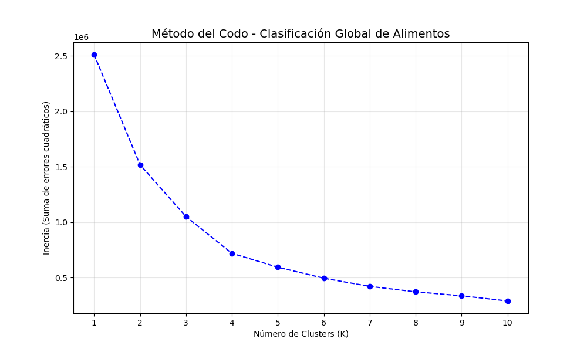
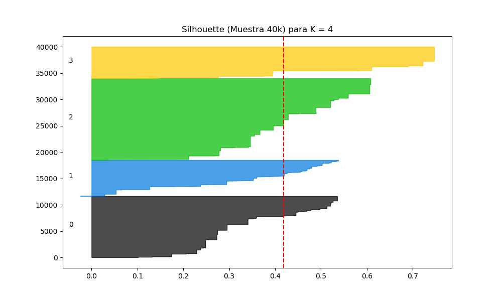
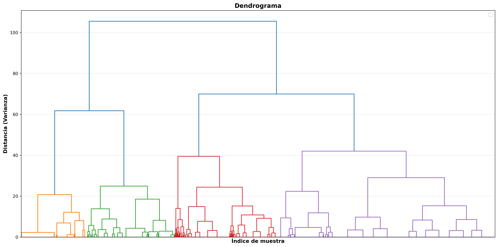
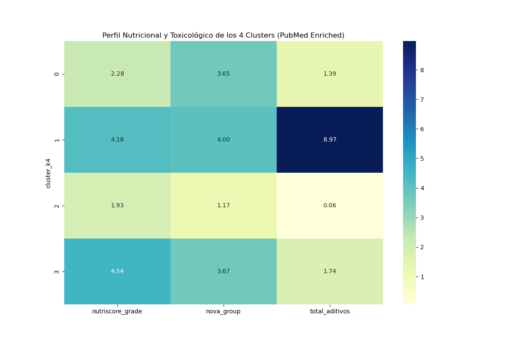
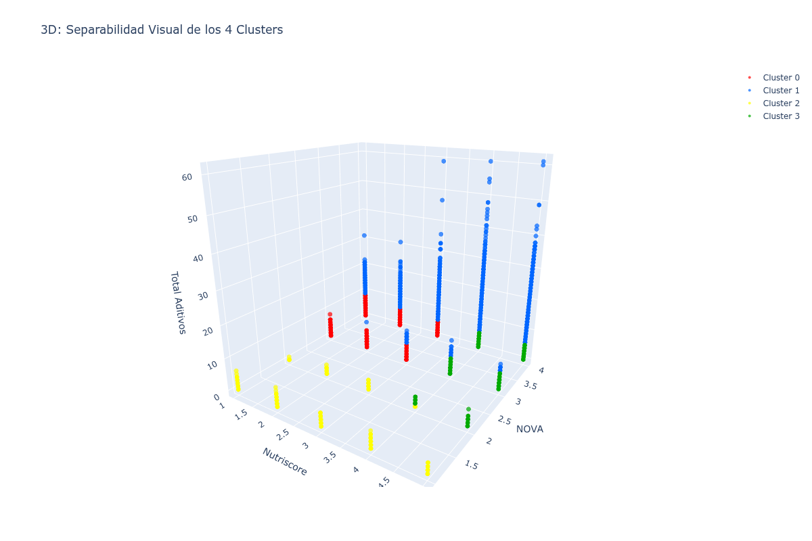
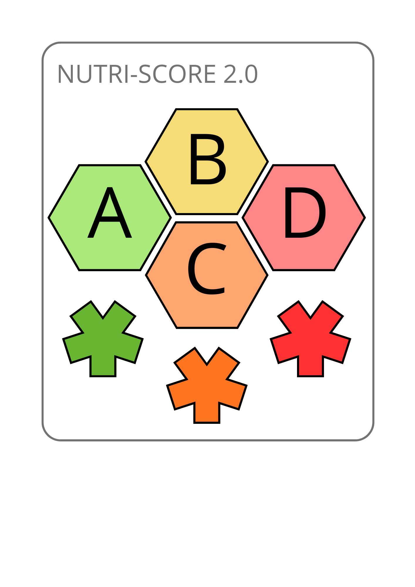

# Nutriscore 2.0: Hacia un etiquetado alimentario más transparente

> **Continuación de:** [Análisis Exploratorio de Datos - Nutriscore es Incompleto y Manipulable](https://github.com/mikel-ao/food-labelling-audit.git)
> 
> **Presentación:** [Canva](https://canva.link/m8gp6zmxdfyloks)
>
> **Prototipo de ** [Nutriscore 2.0](https://nutriscore2-0.streamlit.app/)

## 📋 Resumen Ejecutivo

Este proyecto de ML no supervisado es la **evolución del análisis exploratorio previo** que concluyó que el **Nutriscore clásico** (basado únicamente en nutrientes) es incompleto y puede ser manipulable. 

**Nutriscore 2.0** resuelve esto combinando **3 dimensiones de evaluación:**
- ✅ **Calidad nutricional** (Nutriscore 1-5)
- ✅ **Grado de procesamiento** (NOVA 1-4)  
- ✅ **Seguridad de aditivos** (Scientific Safety Index - SSI)

**Resultado:** Clasificación holística en **4 clusters** con **12 categorías finales**, validada con dos métodos independientes (K-Means + Hierarchical Clustering).

---

## 🎯 Contexto del Problema

### ¿Por qué Nutriscore 2.0?

En 2026, **millones de alimentos** circulan en mercados europeos, pero los consumidores solo tienen **UN etiquetado global**: Nutriscore. Sin embargo:

| Limitación | Impacto |
|-----------|---------|
| Solo analiza **nutrientes** | Ignora si es ultraprocesado |
| No considera **aditivos químicos** | Un "Nutriscore A" puede tener 651 aditivos permitidos pero riesgosos |
| Susceptible a **optimización de formulación** | Empresas pueden mejorar score sin mejorar salud |

**Caso de uso real:** Un zumo de fruta "natural" puede tener:
- ✅ Nutriscore A (bien)
- ❌ NOVA 3-4 (ultraprocesado)
- ⚠️ Aditivos de precaución no visibles en etiqueta

---

## 📊 Análisis de Datos

### Dataset Principal

| Métrica | Valor |
|---------|-------|
| **Alimentos totales** | 836,897 |
| **Aditivos únicos analizados** | 651 |
| **Papers científicos consultados** | 10,400+ (PubMed) |
| **Distribución Nutriscore** | A(15%), B(11%), C(21%), D(24%), E(29%) |
| **Alimentos ultraprocesados (NOVA 3-4)** | 55-60% |

### Distribuciones Clave

```
🔴 PROBLEMA: 53% de alimentos tienen Nutriscore D-E (pobre)
🔴 PROBLEMA: 55-60% son ultraprocesados (NOVA 3-4)
🔴 PROBLEMA: 40-45% contienen 1-3 aditivos; 5-10% contienen 8+ aditivos
```
---

## 🔍 Metodología

### Etapa 1: Clasificación de Aditivos (Scientific Safety Index)

**Proceso:**
1. Búsqueda en **PubMed API** de 651 aditivos × 16 palabras clave = 10,400 búsquedas
2. Extracción de papers por categoría: negativos, positivos, estudios humanos vs animales
3. Filtros inteligentes:
   - Negaciones semánticas: "no dañino" reduce peso de "adverso"
   - Ponderación por tipo de estudio: In vitro ×0.30, animal ×0.50, humano ×1.00
4. **Cálculo SSI:** Fórmula que combina evidencia científica + recencia + confianza
5. Validación contra **EFSA oficial** (si aditivo fue retirado → EVITABLE)

**Resultado:**

```
🟢 SEGURO:      475 aditivos (73%)
🟡 PRECAUCIÓN:   84 aditivos (13%)
🔴 EVITABLE:     92 aditivos (14%)
```

**Código:** `notebooks/01_ssi_aditivos.ipynb`

---

### Etapa 2: Clustering de Alimentos (K-Means + Validación Jerárquica)

**Features seleccionados:**
```python
features = [
    'nutriscore_grade',    # Calidad nutricional (1-5)
    'nova_group',          # Grado de procesamiento (1-4)
    'total_aditivos'       # Cantidad de aditivos (0-20+)
]
```

**¿Por qué estos 3?** Representan las 3 dimensiones independientes de riesgo nutricional.

**Determinación de K:**

| Método | Resultado |
|--------|-----------|
| **Elbow Method** | Codo claro en K=4 |
| **Silhouette Score (K=4)** | 0.41 (Bueno) |
| **Hierarchical Clustering (WARD)** | 4 ramas naturales en altura ~53 |





**Conclusión:** K=4 validado por dos métodos independientes → **ROBUSTO**.

**Código:** `notebooks/02_kmeans_clustering.ipynb`

---

## 📈 Resultados: Los 4 Clusters

### Matriz de Perfiles



### Perfil Detallado de Cada Cluster

#### **Cluster 0: "Falso Saludable"** (21.1% = 176,894 alimentos)

```
Nutriscore:    2.28  ✅ Parece bueno
NOVA:          3.65  ⚠️ Pero ultraprocesado
Aditivos:      1.39  (pocos)

Ejemplos típicos: Zumos "naturales", yogures de dieta, batidos
Riesgo: ENGAÑOSO - Marketing saludable, realidad ultraprocesada
```

#### **Cluster 1: "Simple Malo"** (41.2% = 344,688 alimentos)

```
Nutriscore:    4.54  ❌ Pobre
NOVA:          3.67  ⚠️ Procesado
Aditivos:      1.74  (pocos)

Ejemplos típicos: Refrescos, snacks salados, bollería
Riesgo: CLARO pero "simple" - al menos sabes lo que obtienes
```

#### **Cluster 2: "Verdaderamente Saludable"** (15.6% = 130,602 alimentos)

```
Nutriscore:    1.93  ✅ Excelente
NOVA:          1.17  ✅ Natural
Aditivos:      0.06  ✅✅ CASI NINGUNO

Ejemplos típicos: Frutas frescas, verduras, legumbres naturales
Riesgo: MÍNIMO - La mejor opción
```

#### **Cluster 3: "Ultraprocesado"** (22.1% = 184,543 alimentos)

```
Nutriscore:    4.18  ❌ Malo
NOVA:          4.00  🔴 MÁXIMO procesado
Aditivos:      8.97  ⚠️⚠️ MUCHOS

Ejemplos típicos: Ultraprocesados industriales, comida lista para comer
Riesgo: MÁXIMO - Evitar cuando sea posible
```

### Visualización 3D



**Interpretación:**
- Cada punto = 1 alimento (836k puntos)
- X = Nutriscore (1-5), Y = NOVA (1-4), Z = Total aditivos (0-20+)
- Colores = Clusters K-Means
- Separación clara y natural entre grupos

**Código:** `notebooks/03_visualizacion_resultados.ipynb`

---

## 🎓 Clasificación Final: Nutriscore 2.0

### Arquitectura de Categorización (4 × 3 = 12)

**Punto clave:** Cada alimento tiene DOS dimensiones:

```
┌─────────────────────────────────────────────────┐
│                   ALIMENTO                       │
├─────────────────────────────────────────────────┤
│                                                   │
│  1️⃣  CLUSTER (K-Means sobre 836k)               │
│      └─ Determinado por: Nutriscore + NOVA      │
│         + Cantidad total de aditivos             │
│         └─ Resultado: Cluster 0, 1, 2 ó 3       │
│                                                   │
│  2️⃣  RIESGO DE ADITIVOS (SSI por aditivo)       │
│      └─ Determinado por: PEOR aditivo presente  │
│         ├─ Si hay 1+ aditivo EVITABLE → EVITABLE│
│         ├─ Si hay 1+ aditivo PRECAUCIÓN → PRECAU│
│         └─ Si todos SEGUROS o sin aditivos → SEGURO
│                                                   │
│  CATEGORÍA FINAL = Cluster_Riesgo_Aditivos      │
│  Ej: 0_EVITABLE, 2_SEGUROS, 3_PRECAUCIÓN       │
│                                                   │
└─────────────────────────────────────────────────┘
```

### Algoritmo de Categorización

```python
def categorizar_alimento(alimento):
    """
    Asigna categoría final 0-3 + riesgo de aditivos
    """
    
    # 1. Obtener Cluster (ya calculado en K-Means)
    cluster = alimento['cluster']  # 0, 1, 2 ó 3
    
    # 2. Determinar riesgo de aditivos (el MÁXIMO)
    aditivos = alimento['additives_tags'].split(',')
    
    riesgos = []
    for e_code in aditivos:
        ssi_level = consultar_ssi(e_code)  # SEGURO, PRECAUCIÓN, EVITABLE
        riesgos.append(ssi_level)
    
    # 3. Ganador: el más peligroso (EVITABLE > PRECAUCIÓN > SEGURO)
    if 'EVITABLE' in riesgos:
        riesgo_final = 'EVITABLE'
    elif 'PRECAUCIÓN' in riesgos:
        riesgo_final = 'PRECAUCIÓN'
    else:
        riesgo_final = 'SEGUROS'  # Incluye sin aditivos
    
    # 4. Categoría final
    categoria_final = f"{cluster}_{riesgo_final}"
    
    return categoria_final

```


**Columnas clave:**
- `cluster` → 0, 1, 2, 3 (del K-Means)
- `riesgo_dominante` → SEGUROS, PRECAUCIÓN, EVITABLE (del SSI + lógica "ganador es el peor")
- `categoria_final` → {0-3}_{SEGUROS|PRECAUCIÓN|EVITABLE} (combinación)

---



---

## 📁 Estructura del Proyecto

```
nutriscore-2.0/
│
├── README.md                         
├── pipeline.py                        
│
├── src/
│   ├── data/
│   │
│   ├── models/
│   │
│   ├── notebooks/
│   │
│   ├── resources/
│   │   └── streamlit/
│   │ 
│   └── utils/
│    
│
└── outputs/
    ├── plots/
    │
    ├── memoria/
    │
    └── presentacion/
    
```

---

## 🚀 Cómo Ejecutar el Proyecto

### Requisitos Previos

- **Python 3.9+**
- **Jupyter Notebook** o **JupyterLab**
- Conexión a internet (para PubMed API)

### Instalación

```bash
# 1. Clonar repositorio
git clone https://github.com/tu-usuario/nutriscore-2.0.git
cd nutriscore-2.0

# 2. Crear entorno virtual
python -m venv venv
source venv/bin/activate  # En Windows: venv\Scripts\activate

# 3. Instalar dependencias
pip install -r requirements.txt

# 4. Configurar variables de entorno
cp .env.example .env
# Editar .env con tus credenciales de PubMed
```

### Variables de Entorno Necesarias

```bash
# .env
NCBI_EMAIL="tu_email@example.com"
NCBI_API_KEY="tu_api_key_pubmed"
NOMBRE_HERRAMIENTA="NutriscorePyProject"
```

**Obtener API key PubMed:**
1. Registrarse en [NCBI Account](https://www.ncbi.nlm.nih.gov/account/)
2. Generar API key en "Account Settings"
3. Pegar en `.env`

### Ejecución del Pipeline

```bash
# ✅ OPCIÓN 1: Ejecutar todo de una vez (RECOMENDADO)
python pipeline_maestro_final.py

# ✅ OPCIÓN 2: Ejecutar notebooks en orden (más control)
jupyter notebook notebooks/01_ssi_aditivos.ipynb
jupyter notebook notebooks/02_kmeans_clustering.ipynb
jupyter notebook notebooks/03_visualizacion_resultados.ipynb
jupyter notebook notebooks/04_nutriscore_2_0_final.ipynb

# ✅ OPCIÓN 3: Ejecutar Streamlit app (después de completar pipeline)
streamlit run app/streamlit_app.py
```

#### Pipeline Lógico (Importante entender)

```
ETAPA 1: Clasificar Aditivos (SSI)
├─ Input: 651 aditivos + PubMed
├─ Output: aditivos_ssi.csv (651 rows)
│   └─ Columns: [E_code, nombre, SSI_score, SSI_categoria]
│      └─ SSI_categoria: SEGURO (73%) | PRECAUCIÓN (13%) | EVITABLE (14%)
└─ Nota: SIN esto, no hay riesgo de aditivos

ETAPA 2: Cluster de Alimentos (K-Means)
├─ Input: 836k alimentos + 3 features (Nutriscore, NOVA, total_aditivos)
├─ Output: alimentos_clustering.csv (836k rows)
│   └─ Columns: [product_id, cluster (0-3), ...]
└─ Nota: Independiente de SSI (puro clustering)

ETAPA 3: Mapear Aditivos a Alimentos
├─ Input: 
│   ├─ alimentos_clustering.csv (cluster asignado)
│   ├─ aditivos_ssi.csv (SSI por E_code)
│   └─ additives_tags de cada alimento
├─ Output: nutriscore_2_0_final.csv (836k rows, 12 categorías)
│   └─ Columns: [cluster, riesgo_dominante, categoria_final]
└─ Algoritmo: Para cada alimento:
   1. Lee additives_tags → ["E100", "E101", "E102"]
   2. Consulta SSI de cada → [SEGURO, PRECAUCIÓN, SEGURO]
   3. Ganador = MAX(riesgos) → PRECAUCIÓN
   4. Categoría = f"{cluster}_{riesgo_final}" → "0_PRECAUCIÓN"
```

```
## 📚 Fuentes de Datos

### APIs y Datasets Utilizados

| Fuente | Descripción | URL | Documentación |
|--------|-------------|-----|----------------|
| **Open Food Facts** | Base de datos de productos alimenticios | `https://world.openfoodfacts.org` | [Docs](https://world.openfoodfacts.org/data) |
| **Open Food Facts API - Aditivos** | Taxonomía de 651 aditivos permitidos en UE | `https://world.openfoodfacts.org/data/taxonomies/additives.json` | [JSON](https://world.openfoodfacts.org/data) |
| **Open Food Facts - Dataset Parquet** | 836k+ productos con metadatos nutricionales | `https://huggingface.co/datasets/openfoodfacts/product-database/resolve/main/food.parquet?download=true` | [HuggingFace](https://huggingface.co/datasets/openfoodfacts/product-database) |
| **NCBI PubMed API** | Motor de búsqueda de papers científicos | `https://eutils.ncbi.nlm.nih.gov/entrez/eutils/esearch.fcgi` | [API Docs](https://www.ncbi.nlm.nih.gov/books/NBK25499/) |
| **EFSA (European Food Safety Authority)** | Regulaciones de aditivos alimentarios | `https://www.efsa.europa.eu` | [Base de datos](https://www.efsa.europa.eu/en/food-additives-evaluations) |

### Especificaciones de Descarga

**food.parquet (836,897 alimentos)**
```
Tamaño: ~2.5 GB
Tiempo descarga: 30-60 minutos (conexión 10Mbps)
Columnas principales: product_name, nutriscore_grade, nova_group, additives, packaging, etc.
Fuente: Open Food Facts + HuggingFace Hub
```

**additives.json (651 aditivos)**
```
Tamaño: ~5 MB
Columnas principales: E_number, name, vegan, vegetarian, risk_level, etc.
Fuente: Open Food Facts API
```

---

## 📊 Dependencias

**Python:** 3.9 o superior

**Librerías principales:**

```
# requirements.txt
pandas==2.0.3
numpy==1.24.3
scikit-learn==1.3.0
matplotlib==3.7.2
seaborn==0.12.2
requests==2.31.0
scipy==1.11.1
streamlit==1.26.0
pyarrow==12.0.1
python-dotenv==1.0.0       # Para leer .env
jupyter==1.0.0             # Para ejecutar notebooks
plotly==5.16.1             # Para visualizaciones 3D
```

**Instalación rápida:**

```bash
pip install -r requirements.txt
```

**Notas sobre compatibilidad:**

- **Mac M1/M2:** Puede necesitar `conda` en lugar de `pip` para numpy/scipy
  ```bash
  conda install -c conda-forge scikit-learn scipy
  ```
  
- **Windows + WSL2:** Asegurar que `python-dotenv` esté instalado
  ```bash
  pip install python-dotenv --upgrade
  ```

---

## 🔍 Validación de Resultados

### Convergencia de Métodos

**Punto clave: K=4 se valida con dos enfoques independientes**

```
K-Means (determinístico, optimiza intra-cluster)  → 4 clusters
                        +
Hierarchical Clustering WARD (aglomerativo)       → 4 ramas naturales
                        =
        ✅ CONFIANZA MÁXIMA EN K=4
```

**Métricas:**
- **Silhouette Score (K=4):** 0.41 → Moderado a bueno
- **Elbow Point:** Codo claro y pronunciado en K=4
- **Interpretabilidad:** Cada cluster tiene perfil diferenciado y significativo

### Calidad de Datos

```
✅ Nutriscore: 100% valores entre 1-5
✅ NOVA: 100% valores entre 1-4
✅ Aditivos: Códigos E estandarizados
✅ Sin valores faltantes en features críticas
✅ One-hot encoding validado (651 binarios)
```

---

## 💡 Impacto e Implicaciones

### Para Consumidores
✅ Información COMPLETA en 1 clasificación  
✅ Decisiones informadas basadas en ciencia (PubMed + EFSA)  
✅ Detecta productos "engañosos" (Cluster 0)  
✅ Acceso fácil via app Streamlit  

### Para Industria Alimentaria
✅ Incentivo económico para reducir aditivos riesgosos  
✅ Presión competitiva positiva (diferencial "Cluster 2")  
✅ Marketing científicamente válido  

### Para Reguladores
✅ Herramienta de monitoreo basada en análisis de PubMed  
✅ Datos para revisar aditivos automáticamente  
✅ Apoyo a políticas de salud pública  

---

## ⚠️ Limitaciones Conocidas

| Limitación | Descripción | Solución Futura |
|-----------|-------------|------------------|
| **Sinergia de aditivos** | SSI analiza aditivos individualmente, no interacciones | Estudiar combinaciones peligrosas en PubMed |
| **Completitud de datos OFF** | No todos los alimentos listados tienen aditivos detallados | Usar solo alimentos con datos completos |
| **Cambio regulatorio** | Si EFSA retira/aprueba aditivo, SSI cambia | Pipeline automático con actualización diaria |
| **Sesgo geográfico** | Datos principalmente de Europa occidental | Expandir a más regiones |
| **Ingredientes base** | No analiza azúcares/grasas saturadas específicas | Integrar nutritional labels detallados |


## 🤝 Contribuciones

Las contribuciones son bienvenidas. Para cambios importantes:

1. Fork el repositorio
2. Crea rama (`git checkout -b feature/AmazingFeature`)
3. Commit cambios (`git commit -m 'Add AmazingFeature'`)
4. Push a rama (`git push origin feature/AmazingFeature`)
5. Abre Pull Request


## 👤 Autor

**Mikel Añibarro Ortega**  
Data Science | Bootcamp The Bridge, Campus Bilbao (2026)

### 📌 Conecta conmigo

- 🔗 LinkedIn: [mikelanibarroortega](https://www.linkedin.com/in/mikelanibarroortega/)
- 🔬 ORCID: [0000-0002-2835-5079](https://orcid.org/0000-0002-2835-5079)
- 📧 Email: mklanibarro@gmail.com
- 🐙 GitHub: [@mikel-ao](https://github.com/mikel-ao)

---

## 📚 Referencias

### Repositorios Relacionados
- [Open Food Facts GitHub](https://github.com/openfoodfacts)
- [NOVA Food Classification](https://www.fao.org/documents/card/en/c/CA5644EN)

---

**Última actualización:** Mayo 2026  
**Estado del proyecto:** ✅ Completo | 🚀 Listo para producción  
**Reproducibilidad:** ✅ 100% | Todas las etapas documentadas

